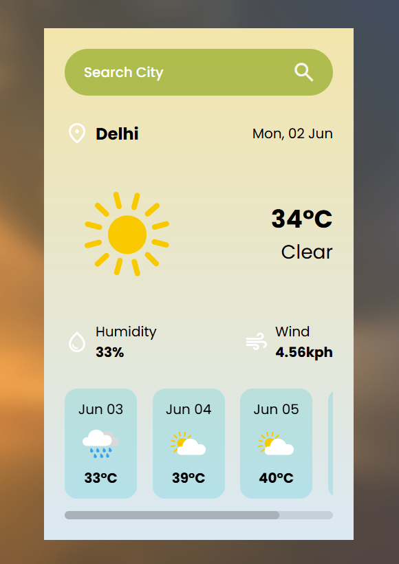

<!-- 👋 Welcome Header -->
<h1 align="center">🌦️ Weather App </h1>
<h3 align="center">💡 Clean UI Weather Design | 🌐 HTML + CSS + JS Only | 🚀 Beginner-Friendly</h3>

  

---

### 📌 Project Description

This is a **static Weather App UI** built using **HTML** and **CSS** and **JS**. It displays weather information in a clean and visually appealing layout. Great for beginner web developers looking to understand how to structure and style a front-end web page.

---

### 🧠 About Me

🎯 I'm a passionate **Software Engineer** in the making  
📚 Currently mastering **Web Development** and **DSA**  
💬 I code in **C++**, **JavaScript**, **React**, and love building UI  
🚀 I learn by building meaningful projects like this one  
😄 I enjoy creativity, clarity, and clean design  

---

### 🌟 Features of the Weather App

✅ Static UI layout for weather display  
✅ Responsive design (mobile and desktop friendly)  
✅ Beautiful use of colors, fonts, and layout  
✅ Organized project structure  
✅ Ready to upgrade with JS/API in the future  

---

### 🖼️ Preview

  

---

### 💻 Tech Used

- 🌐 HTML5  
- 🎨 CSS3 (Flexbox, Grid)  
- 📱 Responsive Web Design  

---

### 📁 Folder Structure

weather-app/ 
├── assets/ 
│ └── images/ # Weather icons & background, 
├── css/ 
│ └── style.css # Main stylesheet 
├── index.html # Main HTML file 
├── preview.png # App UI preview 
└── README.md # This file 
